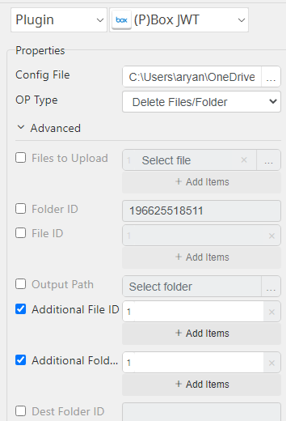
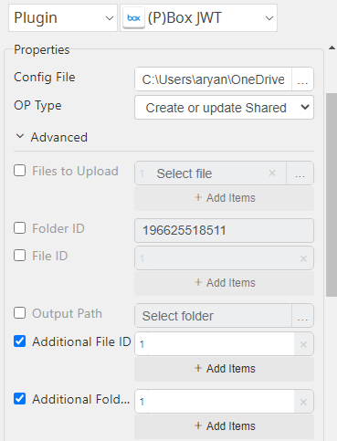

# Box JWT

***This plugin allows generating token from box, show list of files, upload files to box and download files from box.***

## Box JWT
| Item         |           Value           |
|--------------|:-------------------------:|
| Icon         |   |
| Display Name |        **Box JWT**        |

## Arun Kumar (ak080495@gmail.com)

Arun Kumar
* [email](mailto:ak080495@gmail.com) 
 
## Version Control 
* [4.913.1342](setup.yaml)
* Release Date: `September 13, 2022`

## Primary Features
Get the file/folder lists, upload and download the files from BOX

## Create credentials from Box console

1. Create apps in here: https://account.box.com/login?redirect_url=%2Fdevelopers%2Fconsole

# App Setup & Folder Collaboration — Step-by-step Guide

Follow these steps to create a custom app, configure JWT authentication, approve access, and grant folder collaboration.

---

## 1. Create custom app

---

## 2. Fill automation settings

---

## 3. Select **JWT Auth**

---

## 4. Verify JWT auth

---

## 5. Add public key

When you add the public key, the system will download a `config.json` file for you.

---

## 6. Send approval request

Submit an approval request so the app can be enabled; you can disable it later if needed.

---

## 7. Open the Mage Console

---

## 8. Approve the app for access

Approve the pending request to grant the app access.

---

## 9. App approved — now active

Once approved, the app will be active.

---

## 10. Receive a separate email ID for collaboration

You will get a separate email address (account) to use when collaborating on folders.

---

## 11. Open the folder and click **Share** to grant access

Open the folder you want to share and click **Share** to add collaborators.

---

## 12. Access the granted folder and perform operations

After sharing, you (or collaborators) can access the folder and perform the allowed operations.

---

## Input (Required)
| Display Name                 | Selection                           | Default Value          |
|------------------------------|-------------------------------------|------------------------|
| File/Folder Lists            | Config File                         | type,id,name           |
|                              | Folder ID                           |                        |
| Upload Files                 | Config File                         | name,id                |
|                              | Files to Upload                     |                        |
|                              | Folder ID                           |                        |
| Download Files/Folder        | Config File                         | (Downloaded file path) |
|                              | Folder ID or File ID                |                        |
|                              | Output Path                         |                        |
| Copy Files/Folder            | Config File                         | name,id                |
|                              | Additional Folder ID or/and File ID |                        |
|                              | Destination Folder ID               |                        |
| Move Files/Folder            | Config File                         | name,id                |
|                              | Additional Folder ID or/and File ID |                        |
|                              | Destination Folder ID               |                        |
| Delete Files/Folder          | Config File                         | id deleted.            |
|                              | Additional Folder ID or/and File ID |                        |
| Create or update Shared Link | Config File                         | id,link                |
|                              | Additional Folder ID or/and File ID |                        |
| Remove Shared Link           | Config File                         | id remove              |
|                              | Additional Folder ID or/and File ID |                        |

## Return Value

### Normal Case
Description of output result

## Return Code
| Code | Meaning                      |
|------|------------------------------|
| 0    | Success                      |
| 1    | Failure (Invalid Input Type) |
| 99   | Exceptional case             |

## Output Format
You may choose one of 3 output formats below,

<ul>
  <li>String (default)</li>
  <li>CSV</li>
  <li>File</li>
</ul>  

## Parameter setting examples (diagrams)

## Operations

### Get Access Token:

### File/Folder Lists:

### Upload Files:

### Download Files/Folder:

### Copy Files/Folder:

### Move Files/Folder:

### Delete Files/Folder:

### Shared_Link Files/Folder:

